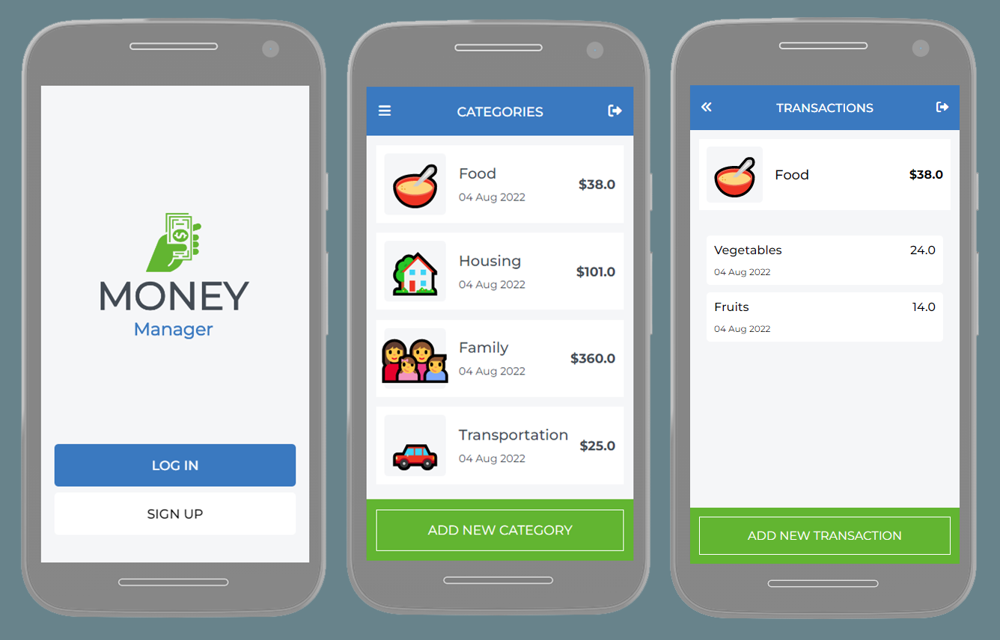

# Money Manager

> A simple, user-friendly mobile web application that helps you manage your budget. You have a list of transactions associated with a category, so that you can see how much money you spent and on what.

## Screenshot

 

## Built With

- Ruby `3.1.2`
- Rails `7.0.3`

<!-- ## Live site 🚀

🔗 [Heroku]() -->

## Getting Started

### Prerequisites

- Ruby

### Setup

To get a local copy up and running follow this simple step:

- Clone repository to your local machine:

```
$ git clone git@github.com:dewslyse/mv-budget-app.git
```

This will create a directory in the name of the project folder.

- Navigate to project folder using 

```
$ cd mv-budget-app
```

### Install

- Install all gems for the project by running:

```
$ bundle install
```


### Create database
- In the `config/` directory, create a new file with the name `local_env.yml` and add the following code:

```
DATABASE_USERNAME: 'Your-PostgreSQL-Username'
DATABASE_PASSWORD: 'Your-PostgreSQL-Password'
```
- Create the database by running: 

```
$ rails db:create
```

### Usage

- Run `rails s` to start the server
- Open `http://127.0.0.1:3000/` in your browser to use the app

### Tests
- Run `rspec` to run the tests

## Author

👤 **Selase**

- GitHub: [@dewslyse](https://github.com/dewslyse)


## 🤝 Contributing

Contributions, issues, and feature requests are welcome!

Feel free to check the [issues page](../../issues/).

## Show your support

Give a ⭐️ if you like this project!

## Acknowledgments

Original design idea by [Gregoire Vella on Behance](https://www.behance.net/gallery/19759151/Snapscan-iOs-design-and-branding?tracking_source=).


## 📝 License

This project is [MIT](./LICENSE) licensed.
